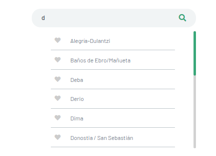
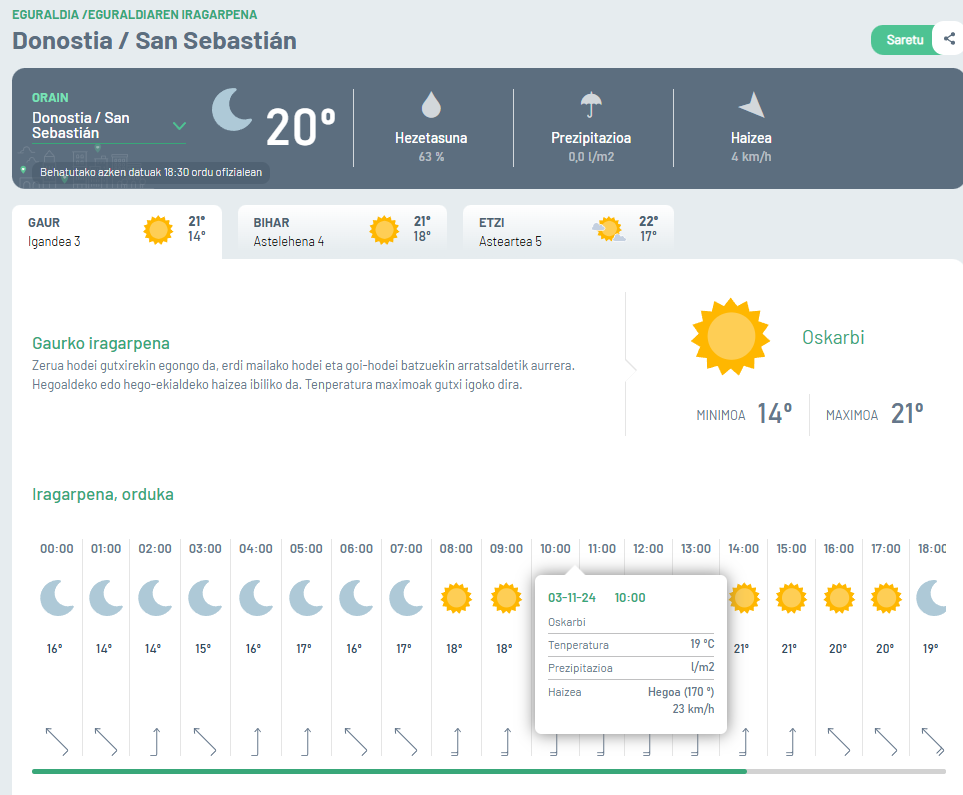

# Eguraldiaren iragarpena

Eguraldiaren iragarpena egiten duen Web aplikazioa garatu behar duzue. Aplikazioak, udalerrien iragarpena egingo du. Erabiltzaileak udalerria aukeratuko du eta aplikazioak bere iragarpena erakutsiko du:

**Udalerria aukeratu:**

**Iragarpena:**

Beharrezko dituzun datuak [euskalmet](https://www.euskalmet.euskadi.eus/hasiera/) edo [aemet](https://www.aemet.es/eu/portada) web guneetatik hartu ditzakezue.

